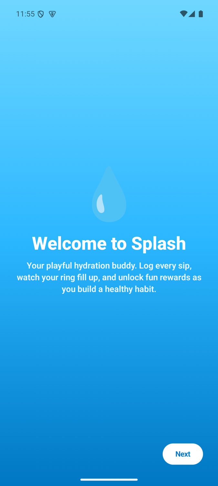
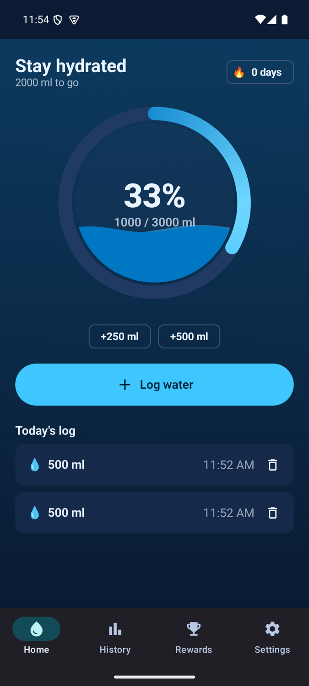
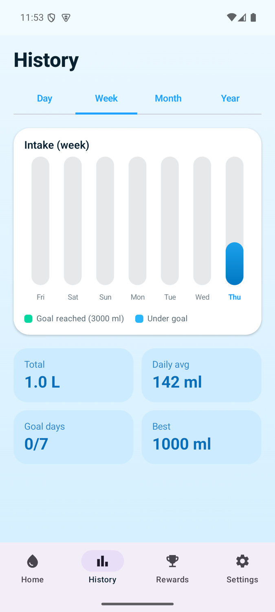
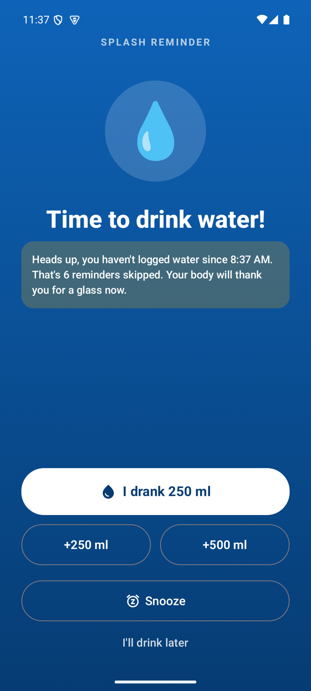
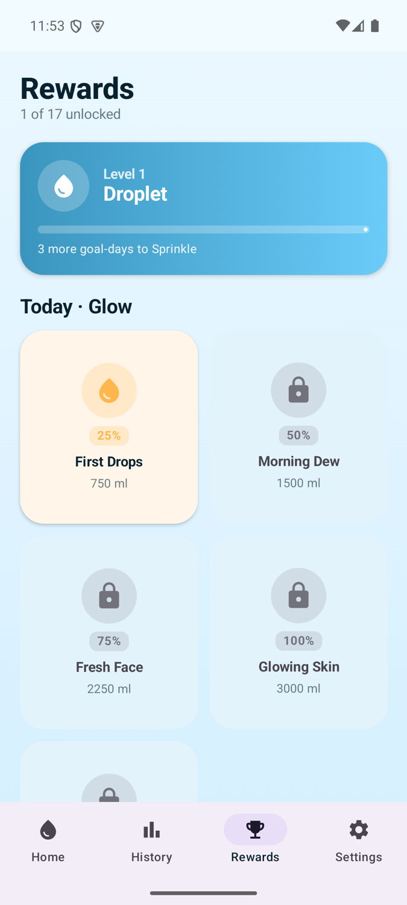
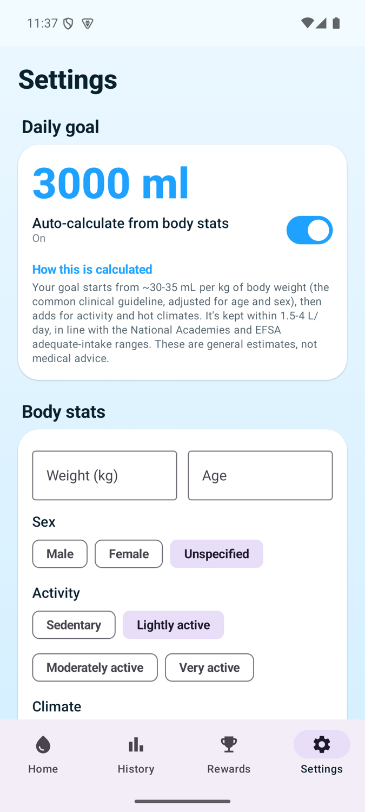
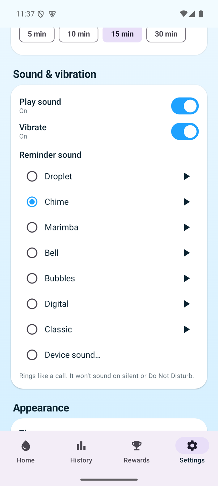

<p align="center">
  
</p>

<h1 align="center">Splash</h1>

<p align="center"><b>A water reminder that rings like a phone call until you drink.</b></p>

<p align="center">
  <a href="LICENSE"></a>
  
  
  
  <a href="https://claude.com/claude-code"></a>
</p>

<p align="center">
  
  
  
</p>

## Why

Every water reminder I installed got swiped away in two seconds. A notification is easy to
ignore, and a habit tracker only helps if you open it.

So I built Splash. When it is time to drink, the reminder takes over the whole screen like an
incoming call and keeps ringing until you answer it. Logging is one tap, and progress is a
game: an animated water orb fills as you drink, and daily cards, levels and streaks reward the
days you hit your goal.

It is fully offline. No account, no cloud, no analytics, and nothing leaves the phone.

Splash is vibe coded with Claude. I decided what it should do and tested it on real phones; Claude wrote the code.

## Features

**Reminders you cannot miss**
- A full-screen, call-style alert that shows even over the lock screen and rings until you act.
- Five actions on the call screen: I drank, +250 ml, +500 ml, Snooze, and I'll drink later.
- **Smart** mode spaces reminders across your waking hours and stops once you hit your goal.
  **Manual** mode uses your own intervals or fixed times.
- Loud and long, like an alarm clock. It plays on the alarm stream at full volume, is heard over
  music and earbuds, and stops by itself after a couple of minutes if you never answer.
- Your phone's default alarm, seven built-in tones, or any sound on your phone.
- Exact alarm-clock scheduling, so reminders survive Doze and battery optimisation.

**Logging**
- One-tap +250 ml and +500 ml chips, plus a custom amount.
- A water orb with a moving wave surface that fills as you log, and confetti when you hit the goal.
- Today's log with undo for mis-taps.

**Goals and progress**
- A daily goal worked out from your weight, age, activity and the season, with a plain-English
  explanation. Always editable.
- Daily reward cards at 25, 50, 75, 100 and 125 percent of your goal, with a theme that
  changes every day.
- Levels from Droplet to Hydration Legend, weekly badges, and a milestone ladder from 3 days
  to 2 years.
- History by day, week, month and year, with goal days in green.

**Everything else**
- Light, dark and system themes.
- Waking window, snooze length, default log amount, sound and vibration settings.

The full product and design write-up, with every screen, the design system, and how the
reminder and reward systems work, is in
[docs/Splash-Product-and-Design.md](docs/Splash-Product-and-Design.md).

## Screenshots

<p align="center">
  
  
  
  
</p>
<p align="center">
  
  
  
</p>

## Tech stack

Kotlin · Jetpack Compose (Material 3) · MVVM with StateFlow · Hilt · Room · DataStore ·
WorkManager and AlarmManager · a foreground service and full-screen activity for the call
screen · Compose Canvas · konfetti.

- `minSdk` 26 (Android 8.0), `compileSdk` and `targetSdk` 35 (Android 15)
- One module, organised by feature under `app/src/main/java/com/splash/water/`

```
data/        Room database, DataStore preferences, repositories
domain/      goal calculator, reminder planner, streaks, levels, rewards, milestones
reminder/    alarm scheduling, the call screen, ringtone service, boot receiver
ui/          Compose screens: onboarding, home, history, rewards, settings
```

## Install

Download **Splash-1.0.apk** from the [latest release](https://github.com/hussaintrawadi/splash/releases/latest)
and open it on your phone. Android asks you to allow installs from your browser or file
manager the first time. It runs on Android 8.0 and later.

## Build and run

1. Open the project in **Android Studio**, which ships with a compatible JDK.
2. Let Gradle sync, then run it on an emulator or a phone with Android 8.0 or later.

From the command line, use Android Studio's bundled JDK, since a newer system JDK can be too
new for this Gradle version:

```bash
export JAVA_HOME="/Applications/Android Studio.app/Contents/jbr/Contents/Home"
./gradlew :app:assembleDebug
```

The APK lands in `app/build/outputs/apk/debug/`. Android Studio creates `local.properties`
(your SDK path) for you, and it is git-ignored.

### Signed release (optional)

Release signing reads `keystore.properties`, which is never committed.

1. Create a keystore:
   ```bash
   keytool -genkeypair -v -keystore app/splash-release.jks -alias splash \
           -keyalg RSA -keysize 2048 -validity 10000
   ```
2. Copy `keystore.properties.example` to `keystore.properties` and fill in your values.
3. Run `./gradlew :app:assembleRelease`.

Without `keystore.properties`, debug builds work normally and the release build is unsigned.
Back the keystore up: updates must be signed with the same key.

## Permissions

| Permission | Why |
|---|---|
| Notifications | To post the reminder |
| Full-screen intent | To show the call screen over the lock screen |
| Exact alarms | To ring on time, even in Doze |
| Foreground service (media playback) | To keep the tone playing until you respond |
| Vibrate, wake lock | To buzz and wake the screen for a reminder |
| Run at startup | To reschedule reminders after a reboot |
| Ignore battery optimisations | Asked once, so aggressive battery savers do not kill reminders |

Splash does not ask for internet access at all.

## Health note

Hydration tips in the app are encouragement, not medical advice. If you have a condition that
affects how much water you should drink, follow your doctor's advice over any app.

## Contributing

Issues and pull requests are welcome. See [CONTRIBUTING.md](CONTRIBUTING.md).

## License

[MIT](LICENSE). Built by [Hussain Trawadi](https://github.com/hussaintrawadi), vibe coded with [Claude](https://claude.com/claude-code).
