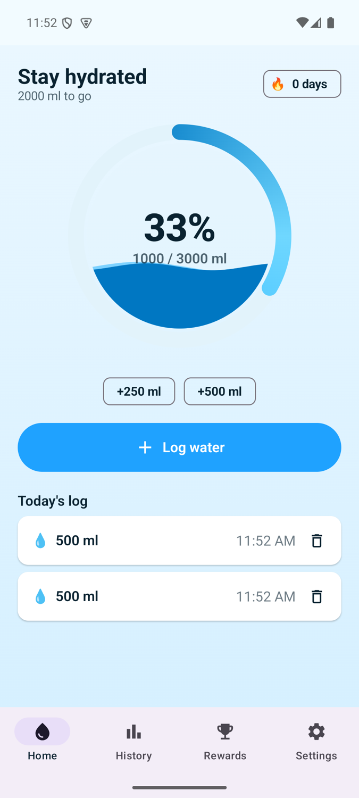
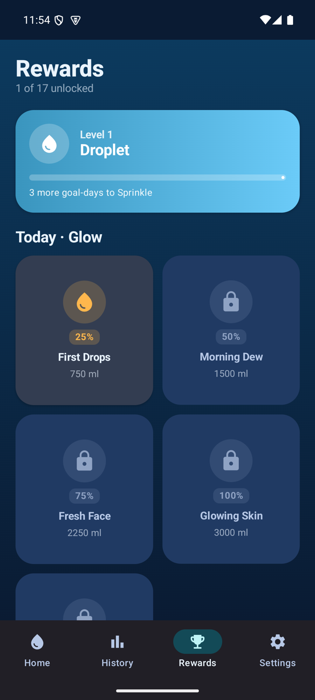
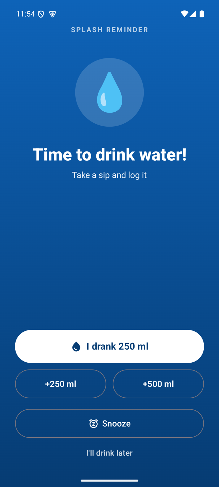

<p align="center">
  
</p>

<h1 align="center">Splash 💧</h1>

<p align="center">A playful Android water reminder that rings like a call until you drink.</p>

<p align="center">
  
  
  
</p>

## What it is

Splash makes drinking enough water actually stick. When it's time to hydrate, a reminder takes
over the whole screen like an incoming call and keeps ringing until you respond (and stays quiet on
silent / Do Not Disturb). Progress feels like a game: an animated water orb fills as you log,
goal-relative reward cards refresh daily, and you climb levels, streaks and milestones.

It's 100% local and offline. No account, no cloud, nothing leaves the phone.

**For the full product & design write-up (every screen, the design system, colors, fonts, the
reminder and rewards systems, and the goal science), see
[docs/Splash-Product-and-Design.md](docs/Splash-Product-and-Design.md).**

## Highlights

- Full-screen, call-style reminders that ring until you act (Smart or Manual scheduling)
- Respects silent & Do Not Disturb; 7 built-in tones + custom sound
- One-tap logging with an animated water orb and a goal celebration
- Daily rewards scaled to your goal, plus levels, weekly badges and long-term milestones
- Goal auto-calculated from body stats using established hydration guidance (editable)
- Light & dark themes, both designed to feel premium

## Tech stack

Kotlin · Jetpack Compose (Material 3) · MVVM + StateFlow · Hilt · Room · DataStore ·
WorkManager + AlarmManager · foreground service + full-screen Activity · Compose Canvas · konfetti.

- `minSdk` 26 (Android 8.0), `compile/target` 35 (Android 15)
- Single module, organized by feature under `app/src/main/java/com/splash/water/`

## Build & run

1. Open the project in **Android Studio** (it ships with a compatible JDK).
2. Let it sync, then Run on an emulator or device (API 26+).

Command line (uses Android Studio's bundled JDK, since a newer system JDK can be too new for Gradle):

```bash
export JAVA_HOME="/Applications/Android Studio.app/Contents/jbr/Contents/Home"
./gradlew :app:assembleDebug
```

`local.properties` (your SDK path) is created automatically by Android Studio; it is gitignored.

## Signed release (optional)

Release signing reads `keystore.properties`, which is **not** committed. To build a signed release:

1. Create a keystore:
   ```bash
   keytool -genkeypair -v -keystore app/splash-release.jks -alias splash \
           -keyalg RSA -keysize 2048 -validity 10000
   ```
2. Copy `keystore.properties.example` to `keystore.properties` and fill in your values.
3. `./gradlew :app:assembleRelease`

Without `keystore.properties`, debug builds work normally and the release build is simply unsigned.

## License

Add a license of your choice (e.g. MIT) before publishing if you want others to reuse the code.
